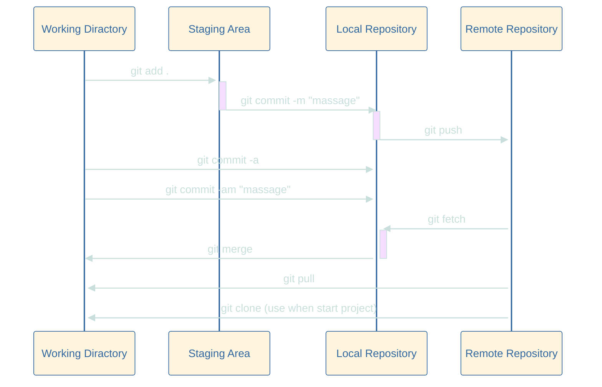

# This repo is create for me to note everythings that i learned about Git and Python 
  
## Data set
let see what we have here to practice  
here is floder that contain 3 file to practice cus you might need some file to merge when you learn Pandas
- [Data set](https://github.com/Nxpze/practice_python/tree/main/Dataset)

## Code and command
### simple command line use in terminal
Herr is some simble commmand to use in your terminal if you use "Macos or Linux" that your terminal use `Zsh or Bash`

---
- command use to move into floder that you want to work on <br>
<span style="color: #e3cf18; font-weight: bold;">Note : 'cd' stand for 'change direction'</span> 
```zsh
cd <floder name>    #move into floder
``` 
- command use to list floder or file in floder you're in <br>
<span style="color: #e3cf18; font-weight: bold;">Note : 'ls' stand for 'list' </span> 

```zsh
ls      #list file or floder     

ls -l   #list file or floder with every detail

ls -a   #list every file include hiding file

ls -al  #ist every file include hiding file with every detail
```
- create new file or floder <br>
<span style="color: #e3cf18; font-weight: bold;">Note : 'mkdir' stand for 'make directory'</span> 

```zsh
touch <file name>       #create new emty file

mkdir <floder name>     #create new emty floder
```
- delete file or floder <br>
<span style="color: #e3cf18; font-weight: bold;">Note : 'rm', 'dir', '-r' stand for 'remove', 'remove directory', 'recursive' </span> <br> <span style="color: #f73838; font-weight: bold;">Warning : delete file in command line will delete it perminantly make sure you're really want to delete it  </span>

```zsh
rm <file name>          #delete file

rmdir <floder name>     #delete emty floder only

rm -r <floder name>     #delete floder and all file that it contained
```

- move file or rename file  <br>
<span style="color: #e3cf18; font-weight: bold;">Note : 'mv' stand for 'move'</span>

```zsh
mv <file name/floder> <new path>                                #move file or floder to new path with same name

mv <file name or floder> <new path/new file name or floder>     #move file or floder to new path with and rename
```

---
### git command line
- first you have to know how to connect your `Terminal` with `GitHub` so you can connect your local repo with remote repo. First try git clone on your terminal 
 
#### connect terminal with Github
1. choose path where you want your local repo to be and use this command 
```zsh
git clone <remote repo url>
```

2. your terminal will show 
`Github user name :` and `Github user password :` in the frist line enter 
your <span style="color: #e3cf18; font-weight: bold;">Github Uername</span> 
and the second one you have enter your <span style="color: #e3cf18; font-weight: bold;">Tokens</span> <br> 
which you can get from Github go to : `Settings > Developer settings > Personal access Tokens > Tokens(classic) > generate new token ` after generate new token 
<span style="color: #f73838; font-weight: bold;">copy it and keep it in the safe place cuz Github will show you only one time </span> and use the token as a password <br> 
<span style="color: #e3cf18; font-weight: bold;">Note : when you paste the token your terminal won't shoe anything just paste and click enter </span>

---
### git common logic 



---

#### basic Git command line
- command use to check your repo status 
```git
git status
```

- command that tranform your normal floder into a local repository
```git
git init 
```

- command that add your file to stage area
```git
git add <file name>                 # add one file

git add <file name> <file name>     # add every file that you list 

git add .                           # add every file that been create or modifile 
```

- commad use to save history of all file that you have add in stage area
```git
git commit -m " commit massage "                # commit all file in stage area

git commit -a                                   # commit all file that git is tracking whichyou don't have to use git add before

git commit -am " commit massage "               # a fusion between -a and -m

git commit --amend -m " new commit massege "    # rename your last commit massage
```

- command use to push all commit that you have made to remote repository
```git
git push                                        # push all commit that have't been push yet 

git push --set-upstream origin <branch name>    # push and set up new branch  on remote repository (use when remote repo don't have this branch yet)
```

- command use to update your local repo with remote repo data
```git
git fetch   # fetch repo from origin/main

git merge   # merge commit from remote repo that you just fetch

git pull    # a fusion between git fetch and git merge

git clone   # use when you don't have that repo on your computer
```

- command that work with branch
```git
git branch                          # check local branch name and branch you work on

git branch -r                       # check remote branch

git branch -a                       # check all branch 

git branch <new branch name>        # create new branch

git switch <branch name>            # switch to branch ou choose

git switch -c <new branch name>     # create new branch and switch to that branch 
```
- command use to check your username and useremail
```git  
git config user.name            # check name user that you use to connect with git in this repo

git config user.email           # check email user that you use to connect with git in this repo

git cinfig --global user.name   # check name user that you use to connect with git in this computer

git comfig --global user.email  # check email user that you use to connect with git in this computer
```

