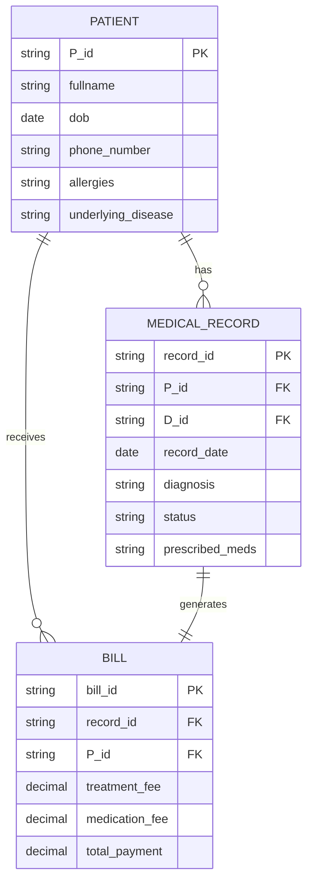

# For-practice-my-python-for-data-analysis-skills
  
## Data set
let see what we have here to practice  
here is 3 file to practice cus you might need some file to merge when you learn Pandas
- [ecommerce order](Https://github.com/Nxpze/For-practice-my-python-for-data-analysis-skills/blob/33d59afe0ac88c0fc1400d6175590ca6c47fc4be/Dataset/ecommerce_orders_practice.csv)
- [customers](Https://github.com/Nxpze/For-practice-my-python-for-data-analysis-skills/blob/33d59afe0ac88c0fc1400d6175590ca6c47fc4be/Dataset/customers.csv)
- [category catalog](Https://github.com/Nxpze/For-practice-my-python-for-data-analysis-skills/blob/33d59afe0ac88c0fc1400d6175590ca6c47fc4be/Dataset/category_catalog.csv)

---
### test mermaid

